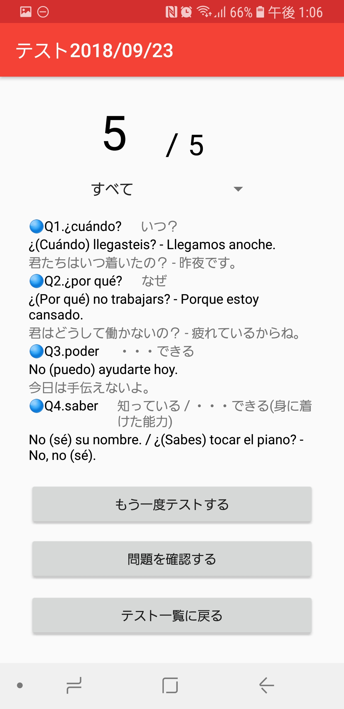

# スペイン語単語テスト

## 概要
自分用のスペイン語単語テストアプリです。

## 説明
例文の穴埋めを一問一答で単語テストできます。 
問題データはDropBoxで管理し自由に問題を追加したり削除したりできます。 
※ DropBoxのアクセストークンは入っておりません。 

## 開発環境
- AndroidStudio 3.2.1
- gradle 3.2.1
- Galaxy S9(それ以外の端末ではレイアウトが崩れる可能性があります)

## 使い方
起動までの準備は[こちら](./doc/db/README.md)を参照してください。
- 試験画面で（）内に入る単語を解答します。

- 問題が規定数終わると試験結果が表示されます。

